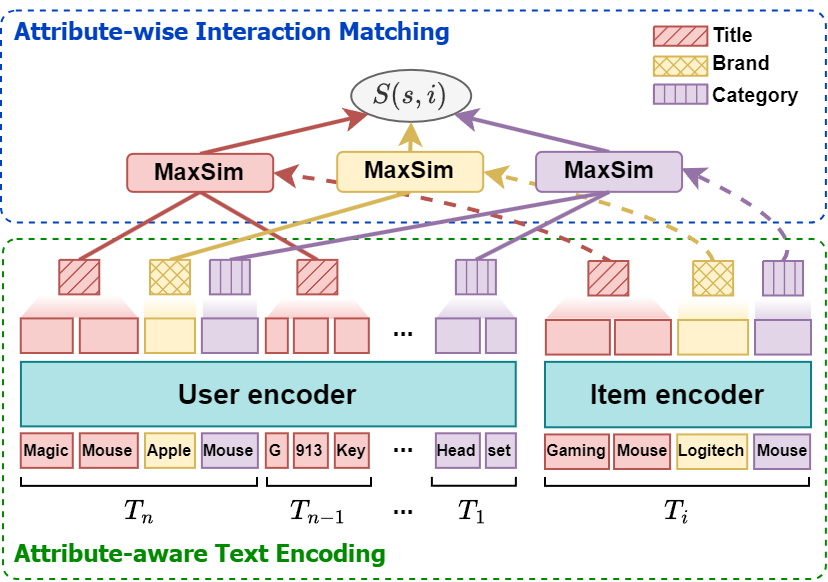

# MARS (CIKM'24)

This is an official repository for our paper **"MARS: Matching Attribute-aware Representations for Text-based Sequential
Recommendation"** in CIKM'24.

## Overview

MARS is a text-based sequential recommendation framework that
effectively captures attribute-wise user/item interactions.



- Attribute-aware text encoding captures the fine-grained user
  preferences based on textual attributes of items.
- Attribute-wise interaction matching identifies the attribute-level
  preference of users.

Please refer to the paper and poster for more details

Paper: [HERE](https://arxiv.org/abs/2409.00702)

Poster: [HERE](assets/poster.pdf)

## Getting Started

### Environment

Please refer to the `requirements.txt` file for the required packages.

```
pytorch-lightning==2.3.3
transformers~=4.28.0
wandb
wonderwords
```

### Dataset

Dataset can downloaded from [HERE](https://cseweb.ucsd.edu/~jmcauley/datasets/amazon_v2/).
Please download the 5-core dataset and metadata, and unzip it to the `dataset` folder.
Run `process.py` as follows:

```
python process.py --file_path path/to/dataset.json.gz --meta_file_path path/to/meta_dataset.json.gz --output_path dataset_name
```

### Training

Run the training script as follows:

```
python main.py --data_path dataset/Scientific_ours --bf16 --num_train_epochs 128 --warmup_steps 800
```

## Acknowledgement

This work is based on and inspired by the methods introduced in [Recformer](https://github.com/AaronHeee/RecFormer).

## Citation

If you find this work useful for your research, please cite our paper:

```
@inproceedings{kim2024mars,
  title={MARS: Matching Attribute-aware Representations for Text-based Sequential Recommendation},
  author={Kim, Hyunsoo and Kim, Junyoung and Choi, Minjin and Lee, Sunkyung and Lee, Jongwuk},
  booktitle={Proceedings of the 33rd ACM International Conference on Information and Knowledge Management},
  pages={3822--3826},
  year={2024}
}
```
